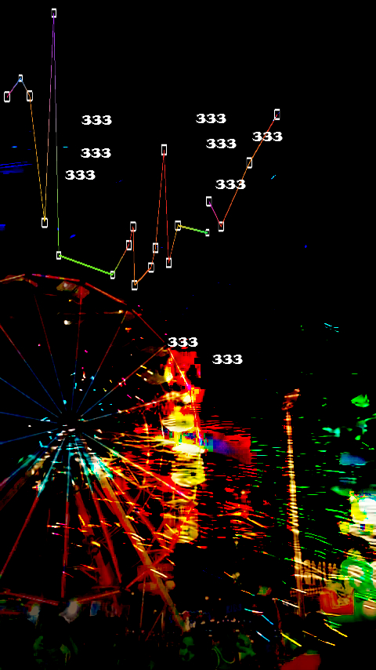
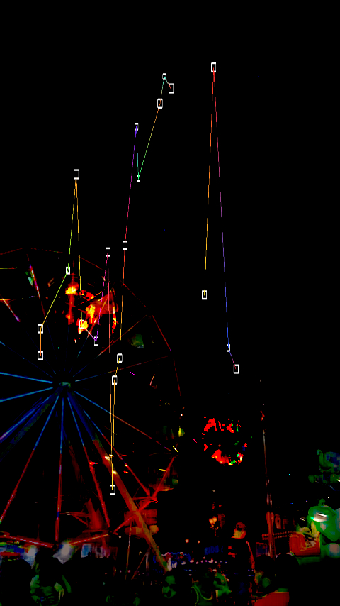
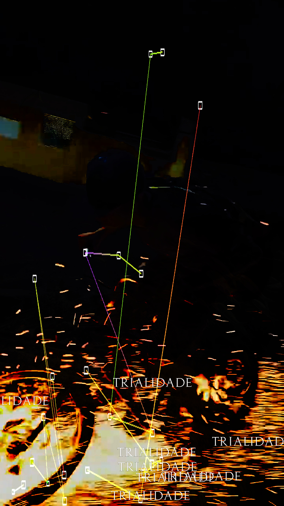
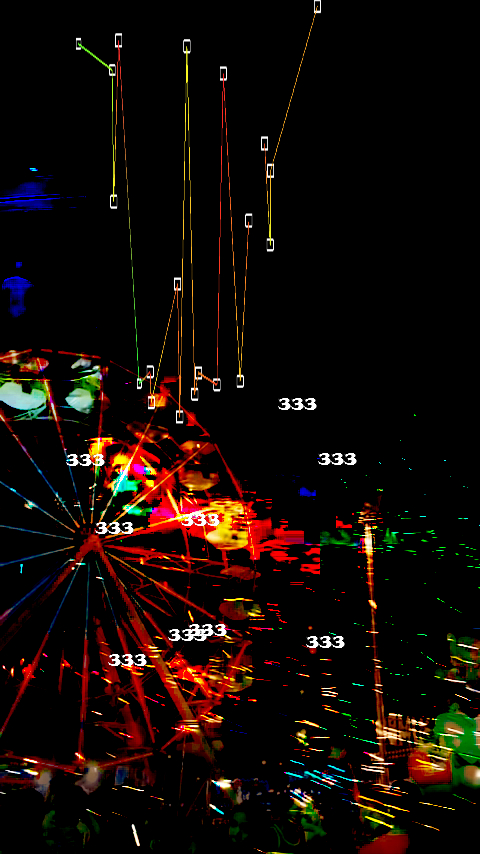
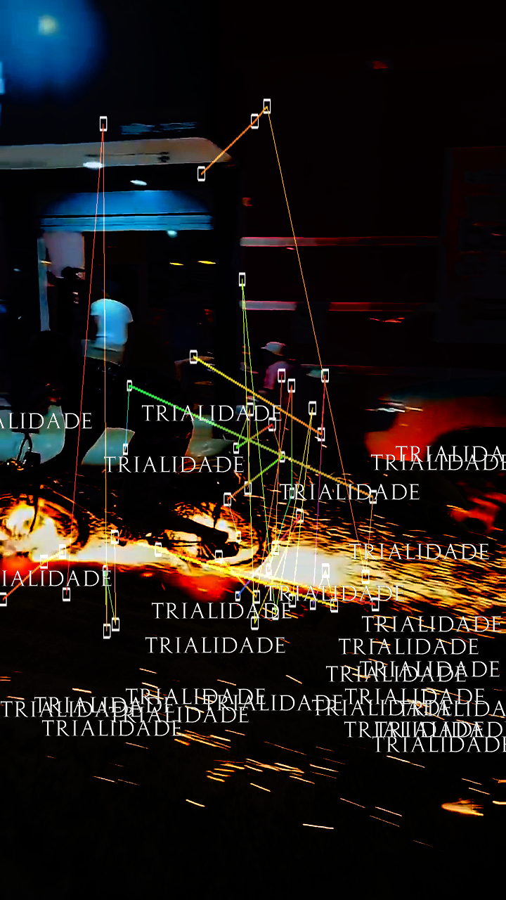
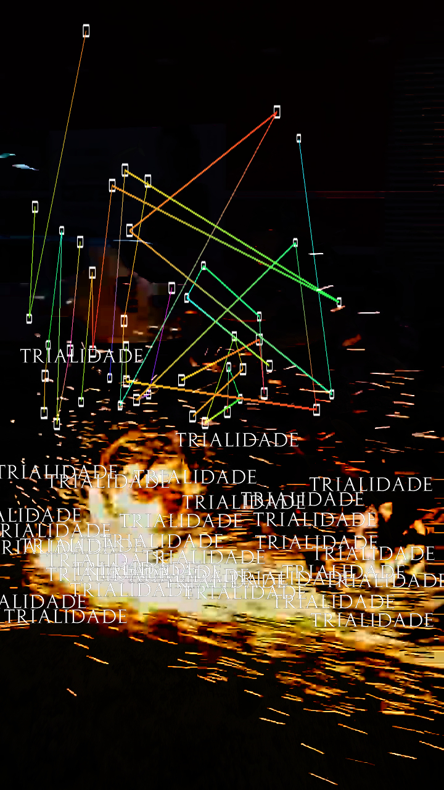

<div align="center">

  # Trialidade Visuals
  


</div>

---

Source code and experiments behind the visuals created for **Trialidade**, an album by **Marcelo USB**.

This project explores the intersection of **computer vision**, **creative coding**, and **real-time visuals**. Using TouchDesigner, Python, and OpenCV, it transforms live video into dynamic visual compositions through custom Blob Tracking and typography that reacts to the detected motion.


## About the album

**Trialidade** is an album by **Marcelo USB**, a music producer from **Teresina, Piauí, Brazil**.

Marcelo started making beats at the age of 17, inspired by the music and experiences around him. In 2020, he decided to dive deeper into music production and has been continuously developing his own sound ever since.

🎧 Check out his work:

- Instagram: https://www.instagram.com/marcelousb_/
- SoundCloud: https://soundcloud.com/marcelousb444

---

## About the project

This repository contains the Python scripts used inside **TouchDesigner** to build a custom computer vision pipeline with **OpenCV**.

The visual system combines two video inputs into a single composition. A Blob Tracking algorithm analyzes the merged image in real time, detecting regions based on brightness and size. These detections are then used to generate visual elements and drive animated typography across the composition.

Rather than simply layering videos, the goal was to create visuals that behave as an extension of the music.

---

## Features

- 🎯 Blob Tracking with OpenCV
- 🎨 Typography following detected blobs
- 📹 Multi-video composition
- ⚡ Real-time visual generation
- 👁️ Computer Vision pipeline
- 💻 TouchDesigner Script TOPs
- 🎭 Creative Coding

---

## Technologies

- TouchDesigner
- Python
- OpenCV
- NumPy

---

## Project Structure

```text
trialidade-visuals/
├── README.md
├── blob_tracking.py
├── typography_follow.py
├── assets/
```
```ruby
# blob_tracking.py

Detects blobs from the merged video input using OpenCV and generates trackingpoints based on contour detection,
filtering, and blob size.

# typography_follow.py

Reads the blob positions and places typography dynamically around the detected regions,
making the text become part of the visual composition.
````
## Preview
<p align="center">
  
  
</p>

<p align="center">
  
  
</p>

<p align="center">
  
  
</p>

<p align="center">
  
  
</p>

---
